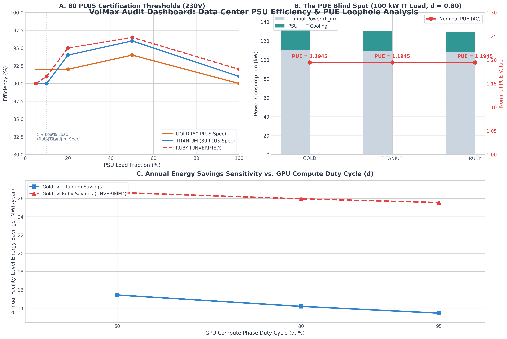

# PUE Loophole Audit: True TCO & Efficiency-Tier Savings in AI Data Centers


When data center operators upgrade server power supplies to high-efficiency tiers (Gold $\rightarrow$ Titanium $\rightarrow$ Ruby), how much energy and cost do they actually save, and why does the industry's primary efficiency metric fail to show it?

This audit applies the **P10 Verification Method** to quantify the **"PUE Loophole"** — a systemic metrology blind spot where internal Power Supply Unit (PSU) conversion losses are categorized as "IT power," causing the nominal Power Usage Effectiveness (PUE) metric to mask actual facility-level energy savings.

---

## 📊 Summary of Audit Findings

### 1. The PUE Loophole Mechanics (Stage 2 Interpretation Artifact)
The industry-standard Power Usage Effectiveness is defined as:
$$PUE = \frac{Total\_Facility\_Power}{IT\_Equipment\_Power}$$

* **The AC Measurement Boundary (The Loophole):** In most enterprise data centers, $IT\_Equipment\_Power$ is measured at the AC input of the server racks (e.g., at the rack PDU), before it enters the server power supply. This means PSU conversion losses ($P_{loss} = P_{in} - P_{out}$) are bundled into the denominator as "IT Power."
* **The Flatline Verdict:** Since all electrical energy delivered to the IT load is ultimately dissipated as heat in the server room, the facility's cooling system must evacuate the entire heat load ($P_{total\_heat} = P_{in}$). With a cooling Coefficient of Performance ($COP$), the cooling power is $P_{cooling} = P_{in} / COP$.
* Under the AC boundary, nominal PUE simplifies to:
  $$PUE_{nominal} = \frac{P_{in} + P_{in}/COP}{P_{in}} = 1 + \frac{1}{COP}$$
  This ratio is **mathematically independent** of PSU efficiency ($\eta$). Consequently, upgrading to Titanium or Ruby PSUs leaves the nominal PUE on paper **completely flat**, mask-hiding the actual megawatt-hours saved at the utility meter.

---

### 2. Workload-Weighted Efficiency & BSP Dynamics (Stage 3 Workload Profile)
Marketing sheets claim peak efficiencies of 96% to 97.5%. However, real servers do not operate continuously at the single peak load point (typically 50% load).
* **Bulk Synchronous Parallel (BSP) Square Wave:** Distributed GPU LLM training workloads exhibit a high-amplitude square-wave power profile:
  * **Compute Phase (TDP):** GPUs run at full capacity ($\approx 98\%$ PSU load) for a fraction of time $d$ (duty cycle).
  * **Communication Phase (AllReduce):** GPU compute engines pause while NICs/CPUs synchronize data, dropping the PSU load to $\approx 40\%$.
* Under conservation of energy, the true time-integrated efficiency $\eta_{weighted}$ is:
  $$\eta_{weighted} = \frac{d \cdot L_{compute} + (1-d) \cdot L_{comm}}{d \cdot \frac{L_{compute}}{\eta_{compute}} + (1-d) \cdot \frac{L_{comm}}{\eta_{comm}}}$$
  Evaluating this physically-grounded average on the 80 PLUS certification thresholds reveals that actual operating efficiencies are significantly lower than vendor-claimed peaks (e.g., Gold runs at **90.44%** operating efficiency on a $d=0.8$ AI workload).

---

### 3. Quantitative Savings & Sensitivity Audit (Stage 4 Verdict)
For a single **100 kW IT rack** running under a liquid-cooled environment ($COP = 4.5\text{--}6.0$, mean $COP = 5.25$) at a utility rate of **$0.15\text{ EUR/kWh}$**:

#### A. Gold $\rightarrow$ Titanium Upgrade
* **Energy Savings:** Saves **1.58 to 1.66 kW** of total facility power, translating to **13.9 to 14.5 MWh/year** of saved energy.
* **Financial Savings:** Saves **$2,085\text{ to }2,175\text{ EUR}$** annually per rack.
* **Nominal PUE:** Flatlines at **1.1667 to 1.2222** across both tiers, showing 0% improvement.

#### B. Gold $\rightarrow$ Ruby Upgrade (*UNVERIFIED*)
* **Energy Savings:** Saves **2.89 to 3.03 kW** of total facility power, translating to **25.4 to 26.6 MWh/year** of saved energy.
* **Financial Savings:** Saves **$3,810\text{ to }3,990\text{ EUR}$** annually per rack.
* **Nominal PUE:** Flatlines at **1.1667 to 1.2222**, showing 0% improvement.

#### C. Sensitivity vs. Duty Cycle ($d$)
The annual MWh energy savings scale with the training duty cycle ($d$), since higher compute utilization drives the PSU deeper into its high-load, lower-efficiency region (100% load):
* At $d = 0.60$: Titanium saves **15.1 to 15.8 MWh/year**
* At $d = 0.80$: Titanium saves **13.9 to 14.5 MWh/year**
* At $d = 0.95$: Titanium saves **13.1 to 13.8 MWh/year**

---

## 📈 Audit Dashboard Visualizations

The generated dashboard in `results/pue_audit_dashboard.png` presents the findings:

* **Panel A:** 80 PLUS certification efficiency thresholds and the low-load (5%) Ruby specification boundary.
* **Panel B:** Visual demonstration of the PUE blind spot: total facility power drops while the nominal PUE line remains flat.
* **Panel C:** Sensitivity of annual energy savings (MWh) as a function of the GPU compute duty cycle ($d$).




---

## 🛠️ Reproduction & Code Structure

### Prerequisites
Make sure you have NumPy and Matplotlib installed:
```bash
pip install numpy matplotlib
```

### 1. Run the PUE Loophole Model
Runs the physical energy balance engine and outputs sensitivity results over different duty cycles $d \in \{0.6, 0.8, 0.95\}$:
```bash
python pue_loophole_model.py --profile bsp --cooling liquid --pue-boundary ac
```
This saves the clean, structured results to `results/audit_metrics.json`.

### 2. Generate Dashboard Figures
Replots the 3-panel professional dashboard shown above:
```bash
python make_figs.py
```

---

## 📚 Critical Ograda & Limitations (Stage 5)

1. **Ruby Certification Status (UNVERIFIED):** The 80 PLUS Ruby certification tier was introduced recently (January 2025/late-stage draft). Because secondary sources report conflicting dates and peak limits, all Ruby numbers in this repository are flagged with `[UNVERIFIED - Ruby]` flags until Delta/CLEAResult publish the official test models.
2. **Measurement Boundary Dependency:** The PUE loophole is purely an artifact of measuring IT power at the AC input. If the operator measures IT power at the DC output of the PSU (direct chip consumption), the PSU loss moves to the numerator, and the loophole disappears (PUE drop is correctly displayed).
3. **Constant COP Assumption:** The cooling system's COP is modeled as a static range. In real facilities, COP fluctuates dynamically with external ambient temperature, load-step transients, and cooling fluid flow rates.


